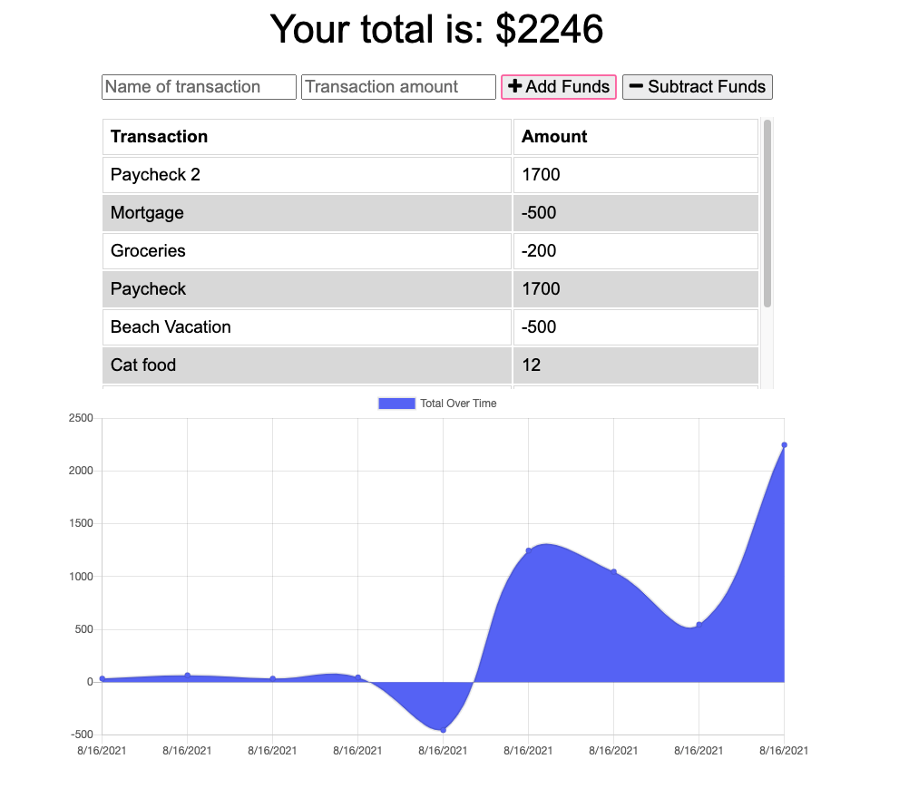

# Budget Tracker

## Table of Contents

- [Description](#description)
- [Technologies](#technologies)
- [Budget Tracker](#Budget-Tracker)

## Description
Budget Tracker was created for users to easily track their personal finances. Budget tracker utilizes IndexDB, service workers, and PWAs to make it accessible as an application for your device and allow offline capabilities. 

## Technologies
- Node
- Express
- Mongoose
- MongoDB
- Heroku
- IndexDB 
- PWAs
- Service workers
## Budget Tracker
https://intense-brushlands-65502.herokuapp.com/
